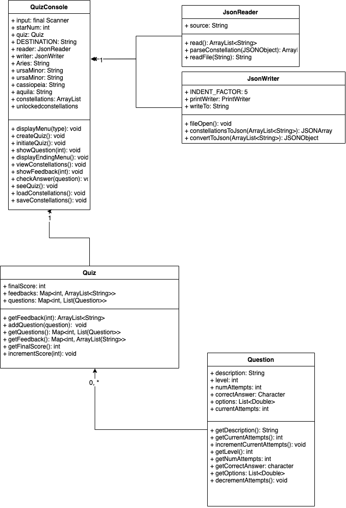

# AstronoMath Educational Quiz

## Description:
AstronoMath is an EdTech mobile application that teaches elementary level math in a fun, cosmic, astronomical way. The user answers math questions in a quiz format. The user starts with a empty night sky, city lights blocking out all starlight. With every correct answer, a star is added to the night sky. The brightness of the star is based on how many attempts it takes for the user to answer a question. The dimmer the star, the more questions the user required until recieving a right answer. Users have 3 attempts maximum for every questions. Stars will slowly accumulate in the night sky the more questions are answered correctly. The user can also unlock constellations at the end of every quiz round. Slowly, their collection of constellations will build. 

### _Who will use it?_
Students ages 4-12 (ie. in elementary school) who struggle with math but want to learn without the pressure of school grades. 
 
### _Educational Concepts_
Elementary math. astronomy, light pollution. 

## User Stories
- As a student, I want to be able to be quickly tap through questions I can practice math but not be bored.
- as a student, I want to be able to percieve my progress and performance in visual, non-numerical way without requiring a grade so that I can have fun learning and not worry about grades.
- As a student, I want to be able to see which questions I struggled with and which I did well in so that I know where to improve.
- As a student, I want to be able to collect constellations so that I can compete with my friends.
- As a student, I want to be able to view my constellations at any time so that I can show my progress in the game to my friends.
- As a student, I want to be able to tap on a constellation in my constellation collection to view its name so that I can know the name and shapes of the constellations I am collecting.

## UML Diagram

## UI 

